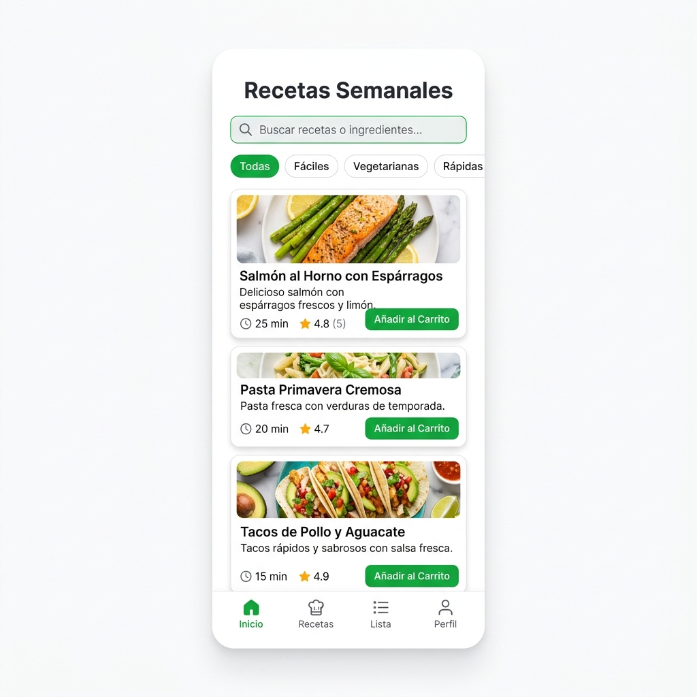
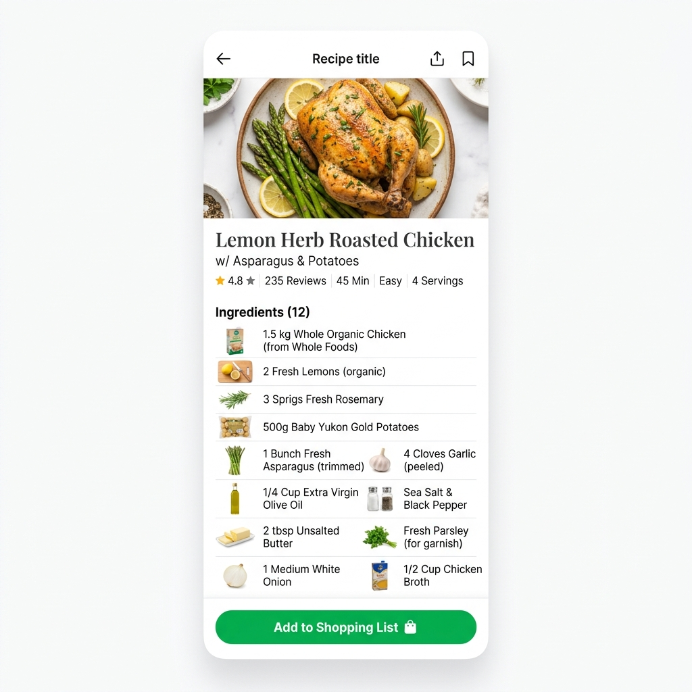
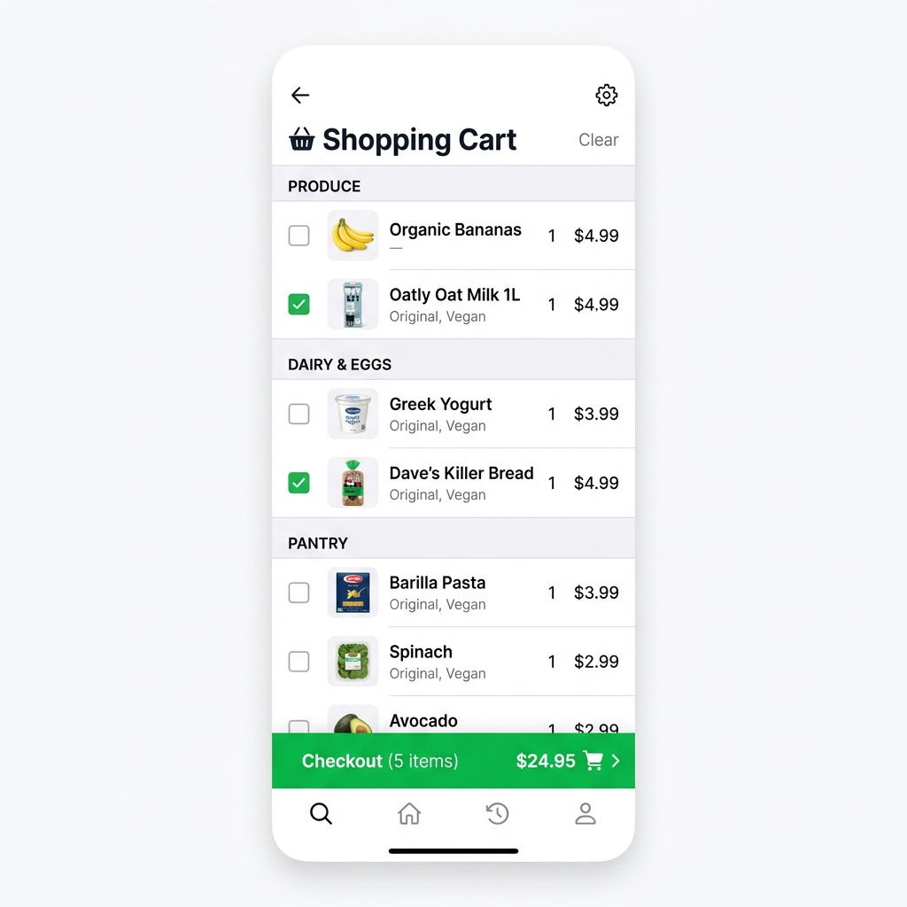

# 🛒 Recetas Hacendado - CyberPandas

[]()
[]()
[]()

> **Proyecto Universitario:** Gestión de Proyectos Universitarios (GII)  
> **Profesor:** Alex R. Villalobos  
> **Equipo:** CyberPandas

---

## 🌟 Visión del Producto

**Recetas Hacendado** es la aplicación definitiva que conecta la indecisión culinaria diaria con la compra eficiente en Mercadona. Soluciona el problema de "qué comer hoy" ofreciendo recetas curadas, escalables y con un cálculo de coste real.

Cuando un usuario ("El Jefe") elige una receta, todos sus ingredientes (exclusivos de la marca Hacendado) se consolidan de forma inteligente en una lista de la compra digital, sin duplicados y organizados por pasillos del supermercado.

---

## 🚀 Funcionalidades Estrella (Deep Scan)

### 1. 🎙️ Modo Cocina "Manos Libres" (Hands-Free Cooking)
La experiencia de cocinar llevada al siguiente nivel. Diseñada para no tener que tocar la pantalla con las manos manchadas.
- **Narración TTS Premium:** La app lee los pasos de la receta en voz alta utilizando voces *Premium/Naturales* del sistema operativo (priorizando *Google español* y *Microsoft Natural* gracias a un sistema de pre-carga asíncrona).
- **Control por Voz:** Usa el micrófono para avanzar de paso, repetir o iniciar temporizadores usando comandos de voz naturales (`"siguiente"`, `"repite"`, `"inicia el temporizador"`, `"pausa"`).
- **Wake Lock API:** Evita que la pantalla del móvil se apague mientras estás cocinando.
- **Temporizadores Inteligentes:** Detecta los minutos mencionados en el paso actual y lanza un temporizador con alarma visual, sonora (chime) y vibración (Haptic Feedback).

### 2. 🤖 Asistente Virtual IA ("Qué Cocino Hoy")
Integración completa con inteligencia artificial **Groq (Llama 3)** para un asistente ultra-rápido en formato *Sheet* deslizable.
- **Sugerencias Contextuales:** Pídele recetas basándote en tu estado de ánimo, tiempo disponible, el número de comensales o simplemente diciéndole los ingredientes que tienes en la nevera para no desperdiciar comida.
- **Entrada por Voz:** Puedes dictarle al asistente tus consultas habladas en lugar de escribirlas usando la `SpeechRecognition` API.

### 3. 🛒 Lista de la Compra Inteligente
No es solo un bloc de notas, es un motor matemático de consolidación.
- **Anti-Duplicados:** Si añades dos recetas que usan el mismo ingrediente (ej. Aceite de Oliva), la lista suma las cantidades exactas (`250ml + 100ml = 350ml`) en vez de crear dos elementos separados.
- **Agrupación por Pasillos:** Los ingredientes se ordenan automáticamente por la sección física del supermercado (Carnicería, Verdulería, Lácteos, Huevos...) para que el recorrido en la tienda sea directo y sin dar vueltas.
- **Cálculo de Precio en Tiempo Real:** Obtén el coste exacto de tu compra total basado en el precio unitario y la cantidad requerida de productos Hacendado.

### 4. 🍽️ Recetas Escalables y Premium
- **Ajuste Dinámico de Raciones:** Cambia el número de comensales y mira cómo todos los ingredientes (y el coste total) escalan matemáticamente al instante.
- **Onboarding y Preferencias:** El usuario configura sus alergias o preferencias (Sin Gluten, Sin Lactosa, Vegano) al registrarse. La app resalta visualmente estos *chips* dietéticos en el catálogo y en la ficha de cada receta.
- **Vista Editorial Inmersiva:** Fichas de receta con diseño premium: incluyen puntuaciones, ingredientes agrupados lógicamente (ej. *Para la salsa*, *Para la masa*) y una barra de acciones interactiva.

### 5. 🔐 Autenticación y Perfil
- **Registro y Login JWT:** Sistema de sesiones seguras con JSON Web Tokens y contraseñas encriptadas.
- **Gestión de Favoritos:** Guarda tus recetas preferidas en tu perfil para tenerlas siempre accesibles.

---

## 💻 Stack Tecnológico Completo

### Frontend (Cliente)
- **Framework:** React 19 + Vite
- **Estilos:** Tailwind CSS v4 + UI Components (réplica meticulosa del sistema de diseño y paleta de colores oficial de Mercadona).
- **Iconografía:** Lucide React
- **Navegación:** React Router DOM v7
- **APIs de Navegador Nativas:** Web Speech API (Synthesis & Recognition), Navigator Vibrate, Screen Wake Lock API.

### Backend (Servidor)
- **Entorno:** Node.js + Express
- **Autenticación:** JWT + Bcrypt
- **Base de Datos:** PostgreSQL (tablas relacionales para usuarios, recetas, ingredientes y listas).
- **Integración IA:** Groq SDK (Llama-3-70b-8192)
- **Arquitectura:** Patrón Modelo-Controlador-Rutas (MVC) y Middlewares de seguridad/autenticación.

---

## 📸 Capturas del Sistema

*(El diseño visual es una réplica premium orientada a la conversión y la accesibilidad)*

<div align="center">
  
  
  
</div>

---

## ⚙️ Estructura del Proyecto y Ejecución

```text
Scrum-Mercadona-CyberPandas/
├── /frontend       # Aplicación React SPA
├── /backend        # API REST Node.js y capa de IA
├── /docs           # Documentación Scrum, Backlog y Sprints
└── /img            # Assets, mockups y diagramas
```

### Cómo ejecutar en local

1. **Clonar el repositorio:**
   ```bash
   git clone https://github.com/Safwat744/Scrum-Mercadona-CyberPandas.git
   cd Scrum-Mercadona-CyberPandas
   ```

2. **Levantar el Backend:**
   ```bash
   cd backend
   npm install
   # Configurar el archivo .env con la URI de PostgreSQL (DATABASE_URL) y Groq (GROQ_API_KEY)
   npm run dev
   ```

3. **Levantar el Frontend:**
   ```bash
   cd frontend
   npm install
   npm run dev
   ```

---
*Hecho con ♥ por el equipo CyberPandas.*
